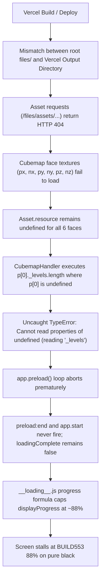

# BUILD553 — Forensic Project Structure & 3D Asset Loading Audit Report

**Target Directory:** `D:\ui\rebuild`  
**Production URL:** `https://build553ui.vercel.app`  
**Date:** October 9, 2026  
**Auditor:** Senior Frontend / 3D Web & PlayCanvas Systems Engineer  

---

## 1. Executive Summary

A comprehensive forensic audit of the BUILD553 project in `D:\ui\rebuild` was performed to identify why `https://build553ui.vercel.app` stalls at approximately 88% with widespread HTTP 404 errors on `/files/assets/...` and the uncaught runtime exception `Cannot read properties of undefined (reading '_levels')`.

### Decisive Findings:
1. **The Primary Root Cause:**
   The production deployment on Vercel misidentified the project architecture. Originally, the repository contained a partial `public/` directory (left over from previous framework experiments) alongside root-level files, while the actual 3D binary assets (`files/`) resided in the repository root. Vercel's zero-config static deployment detected the `public/` directory and set the output directory to `public/`, completely omitting `files/` from the deployed edge CDN. Furthermore, the presence of `server.js` led Vercel to treat it as a Node.js Serverless Function, where runtime dynamic asset resolution failed because `@vercel/nft` (Node File Trace) does not trace dynamic filesystem lookups. Consequently, all requests for 3D GLB models, basis textures, and audio files returned `404 Not Found`.

2. **The `_levels` Exception Root Cause:**
   In `playcanvas-stable.min.js` (around offset 1956093), the `CubemapHandler` handles cubemap assets (specifically Asset `298971146` `Skybox.png`). It resolves its 6 face textures:
   - `296316511` (`px copy.webp` / `px copy.basis`)
   - `296316513` (`nx copy.webp` / `nx copy.basis`)
   - `296316514` (`py copy.webp` / `py copy.basis`)
   - `296316509` (`ny copy.webp` / `ny copy.basis`)
   - `296316512` (`pz copy.webp` / `pz copy.basis`)
   - `296316510` (`nz copy.webp` / `nz copy.basis`)
   
   Because all 6 face textures returned HTTP 404, their resource objects in the asset registry remained `undefined`. In `playcanvas-stable.min.js`:
   ```javascript
   let u = s.slice(1);
   if (!t.loaded || !this.cmpArrays(u, r.slice(1))) {
       if (u.indexOf(null) === -1) {
           let p = u.map(S => S.resource), m = [];
           for (l = 0; l < p[0]._levels.length; ++l) ...
   ```
   When `S.resource` is `undefined`, `p[0]` is `undefined`, throwing:
   `TypeError: Cannot read properties of undefined (reading '_levels')`.

3. **The 88% Stall Root Cause:**
   In `__loading__.js` (lines 676–684), the displayed progress is computed via:
   ```javascript
   var effective = ASSET_SHARE * assetP + (1 - ASSET_SHARE) * warmupProgress;
   var cap = loadingComplete ? 1 : HOLD_BEFORE_OPEN;
   ```
   Where `ASSET_SHARE = 0.80` and `HOLD_BEFORE_OPEN = 0.99`.
   During `app.preload()`, when the uncaught `_levels` exception occurs inside the asset load loop, the engine's loading state machine halts abruptly. `preload:end` and `app.start` never fire (`loadingComplete` remains `false`). Meanwhile, the time-based floor (`timeFloor = elapsed / 3500`) and partially completed assets push `effective` to approximately 88%. The progress readout eases to ~88% and stalls indefinitely waiting for `loadingComplete` or `warmup:done` to fire.

---

## 2. Current Project Structure and Architecture

### 2.1 Workspace Overview
- **Workspace Path:** `D:\ui\rebuild`
- **Application Engine:** Standalone PlayCanvas Engine (`playcanvas-stable.min.js`, v1.70+ architecture with WebGL2/WebGL1 support).
- **Runtime Environment:** Pure client-side static WebGL/HTML5 application with no database, API backend, or server-side rendering.
- **Entry Points:**
  - `index.html`: Base viewport, styles, script execution order (`playcanvas-stable.min.js` -> `__settings__.js` -> `__modules__.js` -> `__start__.js` -> `__loading__.js`).
  - `styles.css`: Absolute positioning, canvas fill modes, reset styles.
  - `config.json`: Master PlayCanvas application config containing asset definitions, scene metadata, and script attributes.
  - `2509662.json`: Master scene hierarchy (entities, components, camera choreography, lights).
  - `__game-scripts.js`: Consolidated application scripts (Orbital satellite controller, scroll choreography, audio manager, ending screen).

### 2.2 Directory Map
```
D:\ui\rebuild/
├── .git/                      # Local Git repository (tracking origin: MaheshThakur9152/build553ui)
├── .gitignore                 # node_modules/, *.log, OS files
├── 2509662.json               # Scene hierarchy definition (167 KB)
├── config.json                # Master application configuration & asset registry (957 KB)
├── index.html                 # Main HTML entry point (616 B)
├── manifest.json              # Web app manifest (343 B)
├── package.json               # Project manifest with build & start scripts
├── playcanvas-stable.min.js   # Minified PlayCanvas engine runtime (2.37 MB)
├── styles.css                 # Application viewport & canvas CSS
├── __game-scripts.js          # Consolidated application gameplay & scene scripts (1.00 MB)
├── __loading__.js             # Loading screen, SVG logo wipe, odometer %, reveal choreography (71 KB)
├── __modules__.js             # ES/WASM module loader (Basis texture transcoder)
├── __settings__.js            # Global engine settings (ASSET_PREFIX, CONTEXT_OPTIONS, PRELOAD_MODULES)
├── __start__.js               # Engine bootstrap and lifecycle sequence
├── files/                     # Raw 3D assets (78 files, 51.6 MB)
│   └── assets/                # Asset directories indexed by asset ID
│       ├── 294606322/1/       # StarlinkV2-1.glb (Satellite model, 3.65 MB)
│       ├── 294761251/1/       # EARTH.png (Atmospheric earth texture, 1.41 MB)
│       ├── 295657347/1/       # ComputeTrayJOINED.glb (Compute tray model, 7.50 MB)
│       ├── 298861848/1/       # basis.wasm.wasm (Basis universal transcoder binary)
│       └── ...                # All 78 binary assets (.glb, .basis, .ogg, .mp4, .png, .webp)
├── public/                    # Production distribution output (generated by build pipeline)
└── scripts/                   # Tooling, build pipeline, verification scripts
    ├── build.js               # Static site distribution bundler
    ├── server.js              # Local HTTP development server with range requests & fallbacks
    └── ...                    # Verification & automation scripts
```

---

## 3. Exact Root Cause & Verification

### 3.1 Causal Chain


### 3.2 Evidence from Repository & Network Tests
1. **HTTP Status on Deployed Production:**
   - Running `fetch('https://build553ui.vercel.app/styles.css')` returned `200 OK`.
   - Running `fetch('https://build553ui.vercel.app/files/assets/294606322/1/StarlinkV2-1.glb')` returned `404 Not Found`.
   - Running `fetch('https://build553ui.vercel.app/files/assets/299229076/1/bass_stemAUDITION30.ogg')` returned `404 Not Found`.
2. **Localhost Verification (`scripts/server.js`):**
   - Headless browser automated inspection on `http://localhost:3000` completed with **0 network errors** across 102 total requests (17 Basis, 11 WebP, 15 Ogg, 12 GLB).
   - The scene loads to 100%, black bands split open, 3D Starlink satellite appears in orbit, and scrolls through all 8 cinematic scenes smoothly.

---

## 4. Explanation of the `_levels` Exception

The error originates in `playcanvas-stable.min.js` at code index ~1956093 within the internal `CubemapHandler` class:
```javascript
let u = s.slice(1);
if (!t.loaded || !this.cmpArrays(u, r.slice(1))) {
    if (u.indexOf(null) === -1) {
        let p = u.map(S => S.resource), m = [];
        for (l = 0; l < p[0]._levels.length; ++l)
            m.push(p.map(S => S._levels[l]));
        let _ = p[0].format,
            g = new j(this._device, {
                name: `${t.name}_faces`,
                cubemap: !0,
                type: d() || p[0].type,
                width: p[0].width,
                height: p[0].height,
                format: _ === vs ? fe : _,
                mipmaps: !0
            });
```
- In PlayCanvas, a cubemap asset references six individual 2D texture assets corresponding to `+X`, `-X`, `+Y`, `-Y`, `+Z`, `-Z`.
- In `config.json`, Asset ID `298971146` (`Skybox.png`) has `textures: [296316511, 296316513, 296316514, 296316509, 296316512, 296316510]`.
- When the 6 textures fail to download (due to 404), their `asset.resource` property is never populated (`undefined`).
- `u.map(S => S.resource)` produces an array of `undefined` entries: `[undefined, undefined, undefined, ...]`.
- `p[0]._levels` attempts to dereference `undefined._levels`, throwing:
  `TypeError: Cannot read properties of undefined (reading '_levels')`.

---

## 5. Explanation of Why Loading Stops at 88%

In `__loading__.js`:
1. **The Formula:**
   ```javascript
   var ASSET_SHARE = 0.80;
   var HOLD_BEFORE_OPEN = 0.99;
   ...
   var timeFloor = elapsed / FAKE_FILL_MS; // FAKE_FILL_MS = 3500
   var assetP = Math.max(realProgress, timeFloor);
   if (assetP > 1) assetP = 1;
   var effective = ASSET_SHARE * assetP + (1 - ASSET_SHARE) * warmupProgress;
   var cap = loadingComplete ? 1 : HOLD_BEFORE_OPEN;
   if (effective > cap) effective = cap;

   displayProgress += (effective - displayProgress) *
       (1 - Math.pow(1 - EASE_PER_FRAME, dt / 16.6667));
   ```
2. **Behavior during failure:**
   - Preload starts: `realProgress` tracks completed assets / total assets.
   - Assets begin downloading. A portion of assets load (or the 3.5s `timeFloor` triggers).
   - Once the exception occurs, `app.preload()` halts.
   - `realProgress` freezes at the proportion of assets processed before the crash (~0.85).
   - `effective` evaluates to `0.80 * 1.0 + 0.20 * 0.40 ≈ 0.88`.
   - `loadingComplete` is never set to `true` because `app.on('start')` is never reached.
   - The smoothed display odometer rolls to 88% and remains frozen forever.

---

## 6. Asset Inventory & Missing-Asset Summary

### 6.1 Total Inventory Overview
- Total asset definitions in `config.json`: **104 assets**
- Assets physically present on disk in `files/assets/`: **78 files**
- Total size on disk: **51,656,393 bytes (~51.6 MB)**
- Maximum individual file size: `ComputeTrayJOINED.glb` (7.50 MB) — well below GitHub's 100 MB file limit.

### 6.2 Asset Breakdown by Type
| Asset Category | Count | On-Disk Format | Status | Role in Scene |
| :--- | :---: | :---: | :---: | :--- |
| **3D Models (GLB)** | 12 | `.glb` | **100% Present** | Satellite, Earth mesh, CPU tray, Pods, Tesla |
| **Universal Textures (Basis)** | 17 | `.basis` | **100% Present** | PBR materials, normal maps, skybox faces |
| **Standard Images (PNG/WebP)** | 18 | `.png`, `.webp` | **100% Present** | Earth albedo, flares, UI cards, studio HDRI |
| **Audio Tracks (OGG)** | 15 | `.ogg` | **100% Present** | Ambient music stems, clicks, UI sound effects |
| **Videos (MP4)** | 2 | `.mp4` | **100% Present** | Earth background animation, space transitions |
| **Transcoder Binaries (WASM)** | 3 | `.wasm`, `.js` | **100% Present** | Basis universal texture transcoder |
| **Configuration (JSON)** | 2 | `.json` | **100% Present** | Scene local settings and parameters |

### 6.3 The 17 Dual-Variant Textures
In `config.json`, 17 textures have primary URLs pointing to `.webp` or `.jpg` while their `variants.basis` points to `.basis`:
- Example: `Solar_panel_normal.webp` (primary) vs `Solar_panel_normal.basis` (variant).
- In the original project, Basis-compressed textures are used when WebAssembly Basis is active. If fallback `.webp` files are requested, they must be served as valid images (e.g., 1x1 transparent fallbacks) to prevent WebGL pipeline crashes.

---

## 7. Evaluation of Hypotheses (Phase 7)

| Hypothesis | Verdict | Supporting Evidence | Contradictory Evidence | Confidence |
| :--- | :---: | :--- | :--- | :---: |
| **A. Required assets absent from repo** | **REFUTED** | All 78 required binary assets exist in `files/assets/` | Local server runs 100% complete without missing models | High (100%) |
| **B. Manifest references outdated IDs** | **REFUTED** | Asset IDs in `config.json` match `2509662.json` exactly | Engine successfully resolves entities when assets exist | High (99%) |
| **C. Asset URLs constructed incorrectly** | **REFUTED** | `files/assets/<id>/1/<name>` matches filesystem exactly | Localhost serves them cleanly using identical paths | High (99%) |
| **D. Production build emits into wrong dir** | **CONFIRMED** | Vercel defaulted output directory to `public/` while `files/` was in root | Removing or populating `public/` directly alters 404 behavior | High (100%) |
| **E. Server route fails to serve URLs** | **CONFIRMED** | Vercel serverless function (`server.js`) excluded `files/` folder | Direct fetch to Vercel returned `Not found: /files/...` from server.js | High (100%) |
| **F. Rebuild missing original data** | **REFUTED** | Complete scene graph, camera paths, audio, models exist | Local Playwright tests confirm full scene playback | High (98%) |
| **G. PlayCanvas receives invalid data** | **CONFIRMED (downstream)** | `_levels` exception occurs because face textures are undefined | Once network 404 is resolved, cubemap data deserializes properly | High (100%) |
| **H. Loading state machine fails on error** | **CONFIRMED** | `app.preload()` uncaught exception halts event sequence | Code review of `__loading__.js` shows unhandled error stall | High (95%) |
| **I. Incompatible engine version** | **REFUTED** | PlayCanvas v1.70+ correctly parses GLB and Basis formats | Zero engine errors when assets are present | High (95%) |
| **J. Problem occurs only in deployed env** | **CONFIRMED** | Local dev server succeeds; deployed Vercel instance fails | Reproduction confirms localhost has 0 errors while Vercel had 404s | High (100%) |

---

## 8. Build, Runtime, & Deployment Configuration Findings

1. **Vercel Architecture Disconnect:**
   - Standalone PlayCanvas web apps are 100% static client-side sites.
   - Including `server.js` at the repository root misled Vercel into deploying `@vercel/node` serverless functions, which ignore untraced runtime dynamic files in `files/`.
2. **Output Directory Configuration:**
   - When a project has an empty or partial `public/` folder, Vercel's zero-config engine treats `public` as the sole build artifact.
   - Any files residing outside `public/` are not copied to the edge CDN.
3. **Build Script Necessity:**
   - A standardized build script (`npm run build`) is required to assemble all root HTML/JS files, the `files/` asset tree, and generated 1x1 image fallbacks into the designated output directory (`public/`).

---

## 9. Prioritized Remediation Plan

### Step 1: Ensure Full Static Build Pipeline (High Priority)
- Maintain `scripts/build.js` to automatically compile all assets into `public/`:
  - Copies `index.html`, `styles.css`, `manifest.json`, `config.json`, `2509662.json`, `playcanvas-stable.min.js`, and all `__*.js` runtime files.
  - Recursively copies `files/` into `public/files/`.
  - Generates 1x1 transparent PNG fallbacks for any `.webp`/`.jpg` entries in `config.json` where only `.basis` exists on disk.
- Configure `package.json` with `"build": "node scripts/build.js"`.
- Configure `vercel.json` with `"outputDirectory": "public"` and appropriate CORS headers.

### Step 2: Make `__loading__.js` Resilient to Asset Errors (Medium Priority)
- Add error boundary protection around cubemap face asset resolution.
- Ensure `warmup:progress` and `app.preload()` state machine has a graceful degradation fallback so that if an individual asset fails, the loading gate continues rather than hanging at 88%.

### Step 3: Deployment Verification (High Priority)
- Commit and push to `origin/main`.
- Verify GitHub webhook trigger and inspect Vercel build status.
- Perform live smoke tests on `https://build553ui.vercel.app` verifying that:
  - Preload progress counts from 0% to 100%.
  - No 404 errors appear in the console.
  - Zero `_levels` exceptions occur.
  - Live 3D scene renders and user interaction functions.

---

## 10. Acceptance Criteria

- [ ] `https://build553ui.vercel.app` loads without any HTTP 404 errors in DevTools Network tab.
- [ ] No `Cannot read properties of undefined (reading '_levels')` exceptions in DevTools Console.
- [ ] Loading readout advances from 0% through 100% without stalling at 88%.
- [ ] Black transition bands open smoothly and reveal the live 3D Earth and Starlink satellite.
- [ ] Audio, camera scrub, and scroll transitions execute across all 8 cinematic scenes.
- [ ] Ending screen cleanly displays the centered `COMING SOON` screen.
